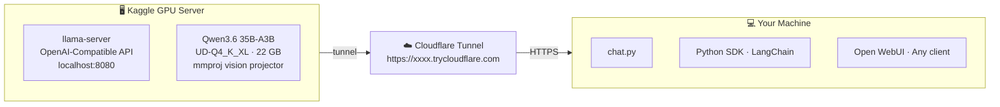

# 🧠 Free LLM Server — Qwen3.6 on Kaggle GPU

Run a **multimodal LLM server** (text + images) on a free Kaggle GPU and connect to it from any machine — no local GPU, no paid plan required.

> **Model:** Qwen3.6-35B-A3B · **Quant:** UD-Q4_K_XL (22.4 GB) · **Backend:** llama.cpp · **Tunnel:** Cloudflare

---

## How it works



The server exposes a standard **OpenAI-compatible API** (`/v1/chat/completions`).
Any client that works with OpenAI works here — just point it to the Cloudflare URL.

---

## Why these tools?

| Tool | Role | Why not the alternative? |
|---|---|---|
| `llama.cpp` | Inference engine | More precise GPU control (`-ngl`), less memory overhead than wrappers |
| Cloudflare Tunnel | Public URL | Ngrok has request limits and cuts long token streams |
| Kaggle | Free GPU | Colab disconnects after ~1.5h; Kaggle runs 12h straight |

---

## Repository structure

```
📁 kaggle-llm-server/
├── 📓 1_setup_dataset.ipynb    ← Run once: downloads model → Kaggle Dataset
├── 📓 1b_setup_llama.ipynb     ← Run once: compiles llama.cpp → Kaggle Dataset
├── 📓 2_run_server.ipynb       ← Run each session: starts server + tunnel
├── 🐍 chat.py                  ← Optional: interactive CLI client with multimodal
└── 📄 README.md
```

---

## ⚡ Quick start with public datasets

Want to skip the 45-minute setup? Use the pre-built public datasets directly.

Instead of running notebooks 1 and 1b, just attach these datasets to `2_run_server.ipynb`:

- **Model** → search `qwen36-35b-a3b-gguf` by `tahsinekajolasalami`
- **Binaries** → search `llama-cpp-bin` by `tahsinekajolasalami`

> ⚠️ The binaries dataset is compiled for Kaggle's T4 GPU environment.
> If Kaggle updates their base image and you get errors, run `1b_setup_llama.ipynb`
> to recompile and create your own dataset. Leave a comment if this happens — I'll update it.

---

## Setup (one time only)

### Step 1 — Download the model

1. Go to [kaggle.com/code](https://www.kaggle.com/code) → **New Notebook**
2. Upload `1_setup_dataset.ipynb`
3. Settings: **Internet ON**, Accelerator: **None**
4. Fill in your Kaggle username in Cell 1
5. Run All

This downloads `Qwen3.6-35B-A3B-UD-Q4_K_XL.gguf` (~22.4 GB) and `mmproj-F16.gguf` (~1 GB) directly from HuggingFace onto Kaggle's servers and saves them as a private Dataset.

> ⏳ ~15–30 minutes (Kaggle ↔ HuggingFace transfer, nothing downloads to your machine)

---

### Step 2 — Compile llama.cpp

1. Create a new notebook, upload `1b_setup_llama.ipynb`
2. Settings: **Internet ON**, **GPU T4 x2**
3. Fill in your Kaggle username in Cell 1
4. Run All

This compiles `llama-server` with CUDA support and saves the binaries as a second private Dataset.

> ⏳ ~26 minutes (compilation) — only ever once, or when you want to update llama.cpp

---

## Running the server

Every time you want to use the LLM:

1. Open `2_run_server.ipynb` on Kaggle
2. Settings:
   - **Accelerator → GPU T4 x2** ← important for full speed
   - **Internet → ON**
   - Add both datasets as inputs: `qwen36-35b-a3b-gguf` and `llama-cpp-bin`
3. Fill in your Kaggle username in Cell 1
4. **Run All**
5. Watch the logs — after ~5–6 minutes you'll see:

```
════════════════════════════════════════════════════════════
  🔗 YOUR SERVER URL
  https://xxxx.trycloudflare.com
════════════════════════════════════════════════════════════

  OpenAI endpoint : https://xxxx.trycloudflare.com/v1
  Direct answers  : python chat.py --url https://xxxx.trycloudflare.com
  Thinking mode   : python chat.py --url https://xxxx.trycloudflare.com --thinking
```

6. Copy the URL — your server is ready.

> The URL changes every session. Copy it fresh each time from the logs.

---

## Connecting your client

The server speaks the **OpenAI API protocol**. Use any compatible client:

**Open WebUI**
```
Settings → Connections → OpenAI API
URL: https://xxxx.trycloudflare.com/v1
Key: none
```

**Chatbox / LM Studio / any client**
```
API Host : https://xxxx.trycloudflare.com
Model    : qwen3.6-35b-a3b
```

**Python (openai SDK)**
```python
from openai import OpenAI

client = OpenAI(
    base_url="https://xxxx.trycloudflare.com/v1",
    api_key="none",
)
response = client.chat.completions.create(
    model="qwen3.6-35b-a3b",
    messages=[{"role": "user", "content": "Hello!"}],
)
print(response.choices[0].message.content)
```

**chat.py — included CLI client (text + images)**
```bash
# Install
pip install openai

# Direct answers (fast)
python chat.py --url https://xxxx.trycloudflare.com

# Thinking mode (step-by-step reasoning, slower)
python chat.py --url https://xxxx.trycloudflare.com --thinking
```

Commands during conversation:
```
/image path/to/photo.jpg   → send an image with your next message
/clear                     → reset conversation history
/history                   → show current conversation
/exit                      → quit
```

**With an image (multimodal) — Python**
```python
import base64

with open("photo.jpg", "rb") as f:
    image_b64 = base64.b64encode(f.read()).decode()

response = client.chat.completions.create(
    model="qwen3.6-35b-a3b",
    messages=[{
        "role": "user",
        "content": [
            {"type": "text", "text": "What's in this image?"},
            {"type": "image_url", "image_url": {"url": f"data:image/jpeg;base64,{image_b64}"}},
        ]
    }],
)
```

---

## Thinking mode

Qwen3.6 is a **hybrid reasoning model** — it can either answer directly or think step-by-step before answering. The mode is controlled **per request**, not at the server level. No restart needed to switch.

### How it works

When thinking is enabled, the model produces a hidden reasoning trace before its final answer. The server strips the trace and returns only the final answer by default.

The mode is passed as an extra parameter in the request body: `chat_template_kwargs`.

### With chat.py

```bash
python chat.py --url https://xxxx.trycloudflare.com             # direct
python chat.py --url https://xxxx.trycloudflare.com --thinking  # thinking
```

### With the OpenAI Python SDK

```python
from openai import OpenAI

client = OpenAI(base_url="https://xxxx.trycloudflare.com/v1", api_key="none")

# Direct mode
response = client.chat.completions.create(
    model="qwen3.6-35b-a3b",
    messages=[{"role": "user", "content": "Your question"}],
    extra_body={"chat_template_kwargs": {"enable_thinking": False}},
    temperature=0.7,
    top_p=0.8,
)

# Thinking mode
response = client.chat.completions.create(
    model="qwen3.6-35b-a3b",
    messages=[{"role": "user", "content": "Your question"}],
    extra_body={"chat_template_kwargs": {"enable_thinking": True}},
    temperature=1.0,   # recommended for thinking mode
    top_p=0.95,
)
```

### With LangChain

```python
from langchain_openai import ChatOpenAI

# Direct mode
llm = ChatOpenAI(
    base_url="https://xxxx.trycloudflare.com/v1",
    api_key="none",
    model="qwen3.6-35b-a3b",
    temperature=0.7,
    model_kwargs={
        "extra_body": {"chat_template_kwargs": {"enable_thinking": False}},
        "top_p": 0.8,
    },
)

# Thinking mode
llm_thinking = ChatOpenAI(
    base_url="https://xxxx.trycloudflare.com/v1",
    api_key="none",
    model="qwen3.6-35b-a3b",
    temperature=1.0,
    model_kwargs={
        "extra_body": {"chat_template_kwargs": {"enable_thinking": True}},
        "top_p": 0.95,
    },
)
```

### With curl

```bash
# Direct mode
curl https://xxxx.trycloudflare.com/v1/chat/completions \
  -H "Content-Type: application/json" \
  -d '{
    "model": "qwen3.6-35b-a3b",
    "temperature": 0.7,
    "top_p": 0.8,
    "chat_template_kwargs": {"enable_thinking": false},
    "messages": [{"role": "user", "content": "Hello!"}]
  }'

# Thinking mode
curl https://xxxx.trycloudflare.com/v1/chat/completions \
  -H "Content-Type: application/json" \
  -d '{
    "model": "qwen3.6-35b-a3b",
    "temperature": 1.0,
    "top_p": 0.95,
    "chat_template_kwargs": {"enable_thinking": true},
    "messages": [{"role": "user", "content": "Solve this step by step..."}]
  }'
```

### Recommended parameters per mode

| Parameter | Direct mode | Thinking mode |
|---|---|---|
| `temperature` | `0.7` | `1.0` |
| `top_p` | `0.8` | `0.95` |
| `enable_thinking` | `false` | `true` |

> **Rule of thumb:** Direct mode for chat, coding, and quick questions. Thinking mode for complex reasoning, math, and analysis tasks.

---

## GPU & performance

| Kaggle GPU | VRAM | Speed |
|---|---|---|
| **2x T4 ✅ recommended** | **30 GB** | **~15–20 tok/s** |
| 1x P100 (default allocation) | 16 GB | ~6–9 tok/s (hybrid GPU+RAM) |

Select **GPU T4 x2** in Kaggle settings before running for best performance.

---

## Session limits (Kaggle free tier)

- **12 hours** max per session
- **30 hours** of GPU time per week
- Model and binaries: stored permanently in your Kaggle Datasets (free, counts toward 100 GB quota)

When the 12h session expires, re-run `2_run_server.ipynb`. Startup takes ~5–6 minutes (model loading only — no recompilation).

---

## 💡 Keep the server alive for 12 hours (headless mode)

By default, Kaggle cuts your session after ~40 minutes of browser inactivity — even if the notebook is still running.

**The fix: use Save Version instead of Run All.**

1. In `2_run_server.ipynb`, instead of clicking **Run All**, click **Save Version** (top right)
2. Choose **Save and Run All (Commit)**
3. Click **Save**

Kaggle will run the notebook as a background task. You can now:
- Close the browser tab
- Shut down your PC
- Leave for up to 12 hours

The server stays online. To get the Cloudflare URL:
1. Go back to the notebook page
2. Click **View active events** (or check the output logs)
3. The URL appears in the logs exactly as in interactive mode

**To stop the server early:**
1. Open the notebook on Kaggle
2. Click **View Active Events**
3. Click **Stop**

**To restart after stopping:**
Click **Save Version** → **Save and Run All (Commit)** → **Save** again.

---

## Updating llama.cpp

Re-run `1b_setup_llama.ipynb`. Cell 4 detects the existing dataset and creates a new version automatically.

---

## Troubleshooting

**"Dataset not found" at startup**
→ Make sure both `qwen36-35b-a3b-gguf` and `llama-cpp-bin` are added as inputs in the notebook settings.

**Server starts but returns gibberish**
→ Known CUDA 13.x bug. Add `--cache-type-k bf16 --cache-type-v bf16` to the server command in Cell 5.

**502 Bad Gateway from Cloudflare**
→ The server process crashed. Check Cell 5 logs — reduce `CTX_SIZE` (try `8192`) or switch to 2x T4.

**Slow responses**
→ You're on P100 (hybrid mode). Switch to **GPU T4 x2** in Kaggle accelerator settings.

---

## License

MIT — do whatever you want with this.
Model weights (Qwen3.6) are released under the [Qwen License](https://huggingface.co/unsloth/Qwen3.6-35B-A3B-GGUF).
